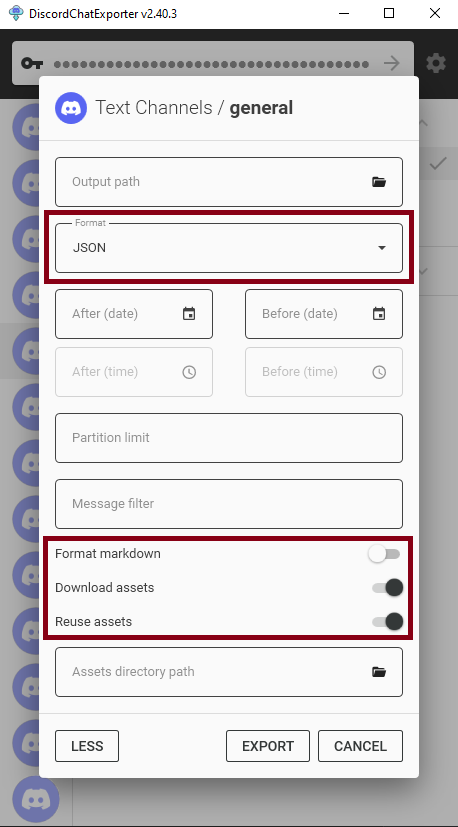

# DiscordChatExporter-frontend (DCEF)

Browse your [Discord chat exports](https://github.com/Tyrrrz/DiscordChatExporter) in a single discord like user interface. [Try a demo in your browser :)](https://dcef.slada.sk/).

## Features

- browse multiple servers, channels, threads and forum posts in a single web based user interface
- search messages in a server with autocomplete
- optimized to handle really large exports well
- customizability - change font and many other things in settings
- self hosting option - you can host DCEF on your own server and share it with your friends. Web interface is mobile friendly too

> Want to chat? Join [Tyrrrz's discord server](https://discord.gg/2SUWKFnHSm). I usually hang out in `#dce-frontend` channel

## Quick start (Windows)

1. Export your data from Discord using [DiscordChatExporter](https://github.com/Tyrrrz/DiscordChatExporter/tree/master/.docs). Your export should be in JSON format, disable `format markdown` option and enable `download assets` and `reuse assets` options. If exporting using a CLI - use `--media --reuse-media --markdown false --format Json` command line options. Include threads and forum posts by adding `--include-threads All` option. More information in [How to export data from Discord to view it in DCEF?](#supported-exports)
2. Download the latest release from [releases page](https://github.com/slatinsky/DiscordChatExporter-frontend/releases)
3. Extract the archive
4. Move all your [DiscordChatExporter](https://github.com/Tyrrrz/DiscordChatExporter) exports to `/exports/` folder ([supported exports](#supported-exports)).
5. Run `dcef.exe`

## Quick start (Linux)


Docker version is the best way to [host the viewer on a server](docs/Server-hosting.md) for others to use.

1. Export your data using [DiscordChatExporter](https://github.com/Tyrrrz/DiscordChatExporter/blob/master/.docs/Getting-started.md#using-the-cli). Use `--media --reuse-media --markdown false --format Json` command line options.

2. Pull the image from docker hub

```bash
docker pull slada/dcef:main
```

3. Navigate to a folder with your exports

```bash
cd /path/to/your/exports
```

4. Run the container
```bash
docker run --restart=always --volume "$(pwd):/dcef/exports" --volume dcef_cache:/dcef/cache --rm --name dcef -p 21011:21011 -it slada/dcef:main
```

5. Open `http://127.0.0.1:21011/` in your browser

**Note:** arm based systems like Raspberry Pi or Apple M1 are not officially supported. Pull requests are welcome :)


## Other ways to run DCEF

<details><summary><b>Windows beta builds</b></summary>

If you want to try out the latest features, you can use [beta builds](https://github.com/slatinsky/DiscordChatExporter-frontend/actions/workflows/windows-build.yml). They are automatically built from the latest commit on `main` branch. You need to be logged in to Github account to download them.

</details>

<details><summary><b>Build docker image from source code on x86_64 architecture</b></summary>

You need docker and git installed. Then run:

```bash
git clone https://github.com/slatinsky/DiscordChatExporter-frontend
cd DiscordChatExporter-frontend
docker build -t dcef .
```
Then use the same instructions as for the Linux docker version, but replace in commands `slada/dcef:main` with `dcef`.

</details>

<details><summary><b>Build docker image from source code on Raspberry pi 4b</b></summary>

You need docker and git installed. Then run:

```bash
git clone https://github.com/slatinsky/DiscordChatExporter-frontend
cd DiscordChatExporter-frontend
docker build -t dcef -f Dockerfile.rpi4b
```
Then use the same instructions as for the Linux docker version, but replace in commands `slada/dcef:main` with `dcef`.

</details>


## Upgrade guide

<details><summary><b>Upgrade windows binary release</b></summary>

Want to upgrade from previous version? Follow these steps:

1. Download the latest release from [releases page](https://github.com/slatinsky/DiscordChatExporter-frontend/releases).
2. Delete everything (except `exports` folder) in your discordchatexporter-frontend folder.
3. Move everything (except `exports` folder) from the new release to your discordchatexporter-frontend folder.

</details>

<details><summary><b>Upgrade docker image</b></summary>

```bash
cd path/to/your/exports/
docker rm dcef --force
docker image rm slada/dcef:main
docker pull slada/dcef:main
docker run --restart=always --volume "$(pwd):/dcef/exports" --volume dcef_cache:/dcef/cache --rm --name dcef -p 21011:21011 -it slada/dcef:main
```

</details>

## Uninstall

<details><summary><b>Windows (binary release)</b></summary>

DCEF does not create any files outside of its folder, so you can just delete the folder to uninstall it.

Move your `exports` folder somewhere else if you want to keep your exports.

</details>

<details><summary><b>Linux (docker)</b></summary>

1. kill and delete the container

```bash
docker rm dcef --force
```

2. remove the volume

```bash
docker volume rm dcef_cache
```

3. remove the image

```bash
docker image rm slada/dcef:main
```

</details>


<a name="supported-exports"></a>
## How to export data from Discord to view it in DCEF?

JSON exports are created using [DiscordChatExporter](https://github.com/Tyrrrz/DiscordChatExporter).

> - JSON export format (`--format Json`) is required
> - Skipping markdown prerendering (`--markdown false`) is highly recommended, but not required
> - Downloading assets (`--media --reuse-media`) is highly recommended, but not required
> - Including threads (`--include-threads All`) is recommended for a full server export


<details><summary><b>Incremental export using DiscordChatExporter-incrementalBackup wrapper</b></summary>

I have created simple wrapper for DiscordChatExporter to simplify the process of incremental export for this frontend viewer. You declare what you want to export in a config file and the wrapper will automatically export only new messages since the last export.

For more information and instructions how to use, see [slatinsky/DiscordChatExporter-incrementalBackup](https://github.com/slatinsky/DiscordChatExporter-incrementalBackup)

</details>

<details><summary><b>Full export using GUI version of DiscordChatExporter</b></summary>

Make sure that export format is set to `JSON` and `Format markdown` is disabled. Optionally, you should also enable `Download assets`+`Reuse assets` option to download images, videos and other types of assets.

Recently `Show threads` option was added to the general settings of DiscordChatExporter - if you want to export threads. Note that fetching threads is slow and it may take a while to show them in the GUI.




Note: Exporting using CLI version of DiscordChatExporter is actually easier if you want to mass export everything.

</details>


<details><summary><b>Full server export using CLI version of DiscordChatExporter</b></summary>

Export all accessible channels, threads and forum posts in a server:
```bash
DiscordChatExporter.Cli.exe exportguild --token DISCORD_TOKEN -g SERVER_ID --media --reuse-media --markdown false --format Json --include-threads All --output OUTPUT_FOLDER_PATH
```


</details>

<details><summary><b>Export private messages using CLI version of DiscordChatExporter</b></summary>

Export all dms (sadly, exporting dms can't be done without selfboting):
```bash
DiscordChatExporter.Cli.exe exportdm --token DISCORD_TOKEN --media --reuse-media --markdown false --format Json --output OUTPUT_FOLDER_PATH
```

</details>


## FAQ

<details><summary><b>No servers show up / troubleshooting steps</b></summary>

See logs (Windows `dcef/logs.txt`, Linux `docker logs dcef`) for more info.

[Windows only] Please check, if the top of the log contains line `windows-runner: OK: All required ports are available.`. DCEF needs ports `21011`, `21013`, `27017`, `58000` to be available. If you have any of these ports occupied, DCEF won't start or won't work properly.

[All platforms] Find line `found X json channel exports` - if this number is 0, you don't have any valid exports in `/exports/` folder.

[All platforms] Find if there is line `preprocess done` (at the end of lines `processing <PATH_TO_JSON_FILE>`) - if you see this line, preprocessing step finished successfully. If you don't see this line, please check if there is any stacktrace in the logs. Stacktrace looks like this:

```
Traceback (most recent call last):
  File "dcef/backend/preprocess/main_mongo.py", line 82, in <module>
    main(input_dir, output_dir)
  File "dcef/backend/preprocess/main_mongo.py", line 67, in main
    raise Exception("Example stack trace exception")
Exception: Example stack trace exception
```

Please [report this issue](https://github.com/slatinsky/DiscordChatExporter-frontend/issues/new) with the stacktrace attached.

[Windows] If no other solution works for you, run Docker version of DCEF.

</details>

<details><summary><b>Some assets won't diplay on Windows / Windows path length limit</b></summary>

Files in `/exports/` folder may exceed Windows path length limit of 260 characters. If you have any issues with loading your assets you can choose one of the following solutions:
- move DCEF to a folder with shorter path
- or run `registry_tweaks/change_260_character_path_limit_to_32767.reg` to increase the limit to 32767 characters (requires admin privileges) and restart your computer. To revert this change, run `registry_tweaks/restore_260_character_path_limit.reg` and restart your computer.

</details>

<details><summary><b>Assets won't display after moving them / how to clear cache</b></summary>

After you put your export to `/exports/` folder, don't remove them. DCEF keeps track of assets and if you remove or move them, they won't show up in DCEF, because the old path would become invalid.

**TL;DR - only adding new files to `/exports/` folder is supported. If you want to remove or move files, you need to clear cache afterwards.**

Clearing cache on Windows:
- close DCEF
- delete `dcef/backend/mongodb/db` folder
- start DCEF again

Clearing cache on Linux:
- kill DCEF container
- remove `dcef_cache` volume (`docker volume rm dcef_cache`)
- start DCEF container again

</details>


<details><summary><b>DCEF hangs and prints `Slow SessionWorkflow loop` to the console / long preprocessing time</b></summary>

`Slow SessionWorkflow loop` messages are completely normal - if you see them, you know that data is pushed to mongodb database and the process is not stuck. Just be patient and wait for the process to finish. If you have a lot of exports, it may take a while.

DCEF is not just an simple viewer. This process enriches your exports with additional data and stores them in a database for search and other features to work.

Impatient? Navigate to `http://127.0.0.1:21011/` in your browser to see already processed exports.

</details>


<details><summary><b>DCEF won't run on M1 mac</b></summary>

[This pull request](https://github.com/slatinsky/DiscordChatExporter-frontend/pull/30) may help you

</details>

<details><summary><b>DCEF is detected as a malware</b></summary>

DCEF is not a malware. It's a false positive. The project is open source, you can check the source code yourself.

The windows release is exactly the same as the ones built on Github's servers by [github actions](https://github.com/slatinsky/DiscordChatExporter-frontend/blob/main/.github/workflows/windows-build.yml). Executables (`nginx.exe`, `mongod.exe`) are sourced from their official websites. I upload releases manually, but the zip is exactly the same as the last successful build on github actions.

Docker image is built on Github's servers github actions [github actions](https://github.com/slatinsky/DiscordChatExporter-frontend/blob/main/.github/workflows/docker-image.yml) too. This action directly uploads the image to docker hub.

But the project uses a lot of dependencies - it is susceptible to supply chain attack such as dependency hijacking. If you find anything suspicious in dependencies used, please let me know.

Tinfoil hat on? Replace `nginx.exe`, `mongod.exe`, `msvcp140.dll` and `vcruntime140_1.dll` with your own trusted copy. Then compile your own version from source code. The easiest way to compile is to run github action on your own fork.

[Related discussion #13](https://github.com/slatinsky/DiscordChatExporter-frontend/discussions/13)

</details>


## For developers

[Architecture choices](docs/Architecture.md)

[Setting up a development environment on Windows](docs/Development-env.md)

[Compile the Windows release from source code](docs/Compile.md)

[Supporting other exporters](docs/Supporting-other-exporters.md)


## Thanks
- [Tyrrrz/DiscordChatExporter](https://github.com/Tyrrrz/DiscordChatExporter) - for a great export tool
- [brussell98/discord-markdown](https://github.com/brussell98/discord-markdown) - for discord markdown rendering library
- [themattman/mongodb-raspberrypi-binaries](https://github.com/themattman/mongodb-raspberrypi-binaries) - unofficial mongodb builds for Raspberry Pi

And for other technologies used in this project - sveltekit, docker, nodejs, nvm, pyinstaller, nginx, mongodb

## Related projects

- [Tyrrrz/DiscordChatExporter](https://github.com/Tyrrrz/DiscordChatExporter) - exporter for your Discord chats
- [Roachbones/discordless](https://github.com/Roachbones/discordless) - real time man-in-the-middle exporter
- [mlomb/chat-analytics](https://github.com/mlomb/chat-analytics) - analytics for your Discord chats
- [slatinsky/DiscordChatExporter-incrementalBackup](https://github.com/slatinsky/DiscordChatExporter-incrementalBackup) - incrementally export your Discord chats for DiscordChatExporter-frontend

## License
GNU GENERAL PUBLIC LICENSE. See [LICENSE](LICENSE) for more details.

This product contains software provided by NGINX and its contributors.

DiscordChatExporter-frontend is not affiliated with Discord. Discord is a registered trademark of Discord Inc.

## Contributing
Feel free to open issues and pull requests.

<details><summary><b>Short guide, how to contribute</b></summary>

- Fork the repository
- Create a new branch
- Implement your changes
- Commit and push your changes
- Create a pull request

</details>


If you find this project useful, give it a star ⭐. Thank you!