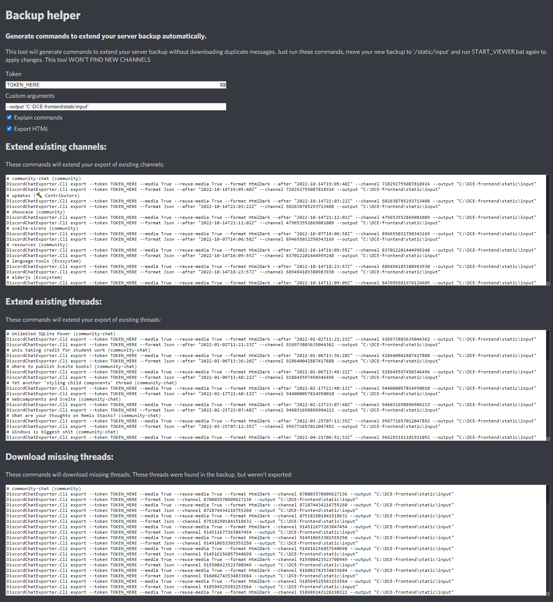

# DiscordChatExporter-frontend
View your JSON [DiscordChatExporter](https://github.com/Tyrrrz/DiscordChatExporter) exports as if you were using Discord interface

## Features
- View JSON exports using web interface
- Message deduplication - merge multiple JSON exports and view them as if they were one
- Advanced message lazy loading and grouping (infinite scroll without pagination) - even channels with 100k+ messages are loaded almost instantly
- Threads support (go to thread, go back to channel where thread was created)
- Forums support (view forum posts as if they were threads)
- Guild search with autocomplete and filters
- View assets files locally or from remote servers
- Browse guild or direct messages
- Discord Markdown rendering support
- Command generator to extend your export with more messages (backup helper)
- Right click message and select "Open in discord" to jump to message in Discord


### System requirements (per guild)
- You will need ~1 GB of RAM to process 100k messages. So if your guild export contains 1 million messages, you will need ~10 GB of RAM.
- The viewer can handle at least ~2-4 million messages (4 GB of ram) in the browser
- Chromium based browsers are recommended (Chrome, Edge, Opera, Brave, Vivaldi, etc.)

Note: Discord servers are known internally as guilds


## Quick start (Windows)
Using prebuilt binaries is the easiest way to use this tool on Windows.
1. Download the latest release from [releases page](https://github.com/slatinsky/DiscordChatExporter-frontend/releases)
2. Extract the archive
3. Move your JSON+media [DiscordChatExporter](https://github.com/Tyrrrz/DiscordChatExporter) exports to `/static/input/` folder ([supported exports](#supported-exports)). Folder structure inside this folder doesn't matter, script will find everything it needs.
4. Run `START_VIEWER.bat` - DiscordChatExporter-frontend will open in your default browser

## Upgrade guide
Want to upgrade from previous version? Follow these steps:

1. Download the latest release from [releases page](https://github.com/slatinsky/DiscordChatExporter-frontend/releases)
2. Extract the archive
3. Move your `/static/input/` folder to the new release folder. DO NOT MOVE `/static/data/` folder, because the format is not compatible between releases.
4. Delete old release folder

## Linux
This tool uses Sveltekit and Python3 as main dependencies. You won't be able to run premade Windows batch scripts, but running this tool on Linux is possible. Linux support is WIP.

<a name="supported-exports"></a>
# Which exports are supported?
The main requirement is that JSON export format (`--format Json`) is used. Archiving assets is recomended (`--media True --reuse-media True`), but not required. There are some examples:

Export all accessible channels from guild:
```
DiscordChatExporter.Cli.exe exportguild --token DISCORD_TOKEN -g GUILD_ID --media True --reuse-media True --format Json --output OUTPUT_FOLDER_PATH
```
Export all dms (sadly, exporting dms can't be done without selfboting):
```
DiscordChatExporter.Cli.exe exportdm --token DISCORD_TOKEN --media True --reuse-media True --format Json --output OUTPUT_FOLDER_PATH
```
Export channel:
```
DiscordChatExporter.Cli export --token DISCORD_TOKEN  --media True --reuse-media True --output OUTPUT_FOLDER_PATH --format Json --channel CHANNEL_OR_THREAD_ID
```
- disadvantage of export with media files is, that original URLs are not archived

<details><summary>I want to export HTML</summary>
<p>
You do not need HTML exports (you can view JSON exports in this viewer), but if you need them, they are supported too:

```
DiscordChatExporter.Cli export --token DISCORD_TOKEN --output OUTPUT_FOLDER_PATH --format Json --channel CHANNEL_OR_THREAD_ID

DiscordChatExporter.Cli export --token DISCORD_TOKEN --output OUTPUT_FOLDER_PATH --media True --reuse-media True --format HtmlDark --channel CHANNEL_OR_THREAD_ID
```

- disadvantage is, that thumbnails for embeds will not be working in this viewer if you export this way (workaround by html parsing is made, but it doesn't work for all embeds)

**another method**

```
DiscordChatExporter.Cli export --token DISCORD_TOKEN --output OUTPUT_FOLDER_PATH --media True --reuse-media True --format Json --channel CHANNEL_OR_THREAD_ID

[replace in folder name `.json_Files` to `.html_Files`]

DiscordChatExporter.Cli export --token DISCORD_TOKEN --output OUTPUT_FOLDER_PATH --media True --reuse-media True --format HtmlDark --channel CHANNEL_OR_THREAD_ID
```
- original URLs are not archived, but embeds will work in this viewer


</p>
</details>


## How to view threads
- This viewer supports viewing threads, but they need to be exported by [DiscordChatExporter](https://github.com/Tyrrrz/DiscordChatExporter). Export them the same way you export channels (`--channel`), but instead of CHANNEL_ID, use THREAD_ID. Because threads are channels.

Don't know how to get THREAD_IDs? Handy backup helper is included to extend your backup and to find missing threads. You can find it at the end of channel list.



## How to view forums
Viewing forums is supported by this viewer, but exporting them with DiscordChatExporter is harder than with other channel types, because export of main forum channel is not supported.

Workaround is to export individual forum threads. I made a script to get forum IDs automatically:

### Steps
1. Open discord in browser
2. Navigate to channel with forum post list
3. press F12 and paste this script to the console:

```js
len = 0
ids = []
previouseScrollTop = 0

function scrollToPosition(offset) {
    scrollDiv = document.querySelector('div[class*="chat-"] > div > div > div[class*="scrollerBase-"]')
    scrollDiv.scroll(0, offset)
}

function captureIds() {
    document.querySelectorAll('div[data-item-id]').forEach((e) => ids.push(e.dataset.itemId))
    ids = [...new Set(ids)]  //deduplicate
    if (ids.length > len) {
        len = ids.length
        console.log('Found', len, 'IDs')
    }
}

function printIds() {
    // print all ids, comma separated
    console.log('found IDs:',ids.join(','))
}

scrollToPosition(0)
interval = setInterval(() => {
    scrollToPosition(scrollDiv.scrollTop + window.innerHeight / 3)
    setTimeout(() => {
        captureIds()
        if (previouseScrollTop === scrollDiv.scrollTop) {
            clearInterval(interval)
            printIds()
        }
        previouseScrollTop = scrollDiv.scrollTop
    }, 1000)
}, 1542)
```

4. script will scroll the page. At the the end, it will print all IDs to the console
5. download each id with DiscordChatExporter as if you would download channel (--channel FORUM_POST_ID)

# Development
You don't need to follow development steps if you don't need to modify the code.


This tool consists of two parts:
- Frontend - Sveltekit app
- Parser - Python3 script to preprocess JSON exports for frontend
## Preprocessor
For development make sure you have nodemon installed globally (used for hot reloading)
```
nvm use 16.16.0
npm install -g nodemon
```

Then install python3 dependencies
```
py -m pip install imagesize
```

Then run
```
cd preprocessor
WATCH_DEV.bat
```

preprocess script will:
- merge JSON files by guilds
- deduplicate messages, authors and reactions to reduce used memory footprint
- pair messages with their media files
- save processed data to `/static/data/` folder. You can delete this folder at any time, original JSON files in `/static/input/` will never be changed.

After running preprocess script, don't remove `/static/input/` folder - it's needed to serve media files.

## Frontend
Run dev webserver:
```
npm run dev -- --open
```

6. If everything was done correctly, DiscordChatExporter-frontend will open in your browser.


# Building release binaries from source (Windows)
## Requirements
- Node.js 16
- Python 3.9+
- pyinstaller (installled globally)
```
py -m pip install pyinstaller
```
pkg (installed globally)
```
npm install -g pkg
```

## Steps
1. Clone this repository
```bash
git clone https://github.com/slatinsky/DiscordChatExporter-frontend
```
2. Install dependencies
```bash
npm install
cd server
npm install
cd ..
```
3. Make sure you have Python3.9+ Node.js 16 and pyinstaller installed:
```
>py --version
Python 3.10.2
```
```
>node --version
v16.14.2
```
```
>pyinstaller --version
5.5
```

4. Kill `npm run dev` if it is running

5. Run the build script
```bash
BUILD_RELEASE.bat
```

6. Release binaries will be in `/release/` folder


<details><summary>Tested on</summary>
<p>

```
>winver
Windows 10, 21H2
Os build: 19044.1766

>py --version
Python 3.10.2

>node --version
v16.14.2

>pyinstaller --version
5.5

>pkg --version
5.8.0

DiscordChatExporter version:
v2.36.1

Processor:
AMD Ryzen™ 7 5800H

400k messages with 18GB of media files
```


But should work on any Windows 10 / Windows 11 x64 computer.

</p>
</details>


## Roadmap / planned features:
- Better handling of edge cases (if something is missing in the backup)
- make readme easy to understand
- Linux support (docker?)
- Improve code readability

## Why this tool was made
[DiscordChatExporter](https://github.com/Tyrrrz/DiscordChatExporter) is a well made tool to export Discord chats. But to actually view them, you had to download them in HTML format, which more inconvenient to parse than JSON. And If you wanted to extend your backup, it would be broken into multiple files, which is not very convenient.
## Thanks
- [Tyrrrz/DiscordChatExporter](https://github.com/Tyrrrz/DiscordChatExporter) - for a great tool. Many CSS definitions from this tool are used in our viewer.
- Discord - for a great chat app
- pyinstaller - for python to binary converter
- [brussell98/discord-markdown](https://github.com/brussell98/discord-markdown) - for discord markdown rendering


## License
GNU GENERAL PUBLIC LICENSE

## Contributing
Feel free to open issues and pull requests.

The best way to support this project is to star it here on GitHub.