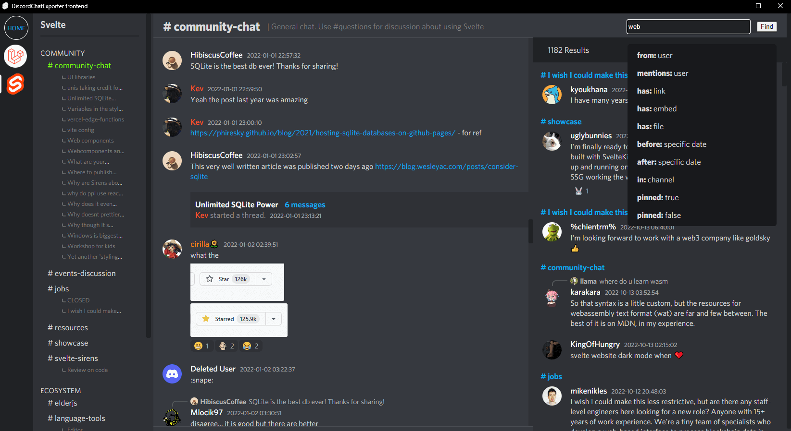

# DiscordChatExporter-frontend
View your JSON [DiscordChatExporter](https://github.com/Tyrrrz/DiscordChatExporter) exports as if you were using Discord interface

## Features
- View JSON exports in Discord like interface
- Message deduplication - merge multiple JSON exports and view them as one
- Optimized infinite scroll - channels are loaded almost instantly
- Forums and threads support (jump to thread and back)
- Guild search with filters and autocomplete
- Load assets locally or from discord servers
- Private messages or guild exports are supported
- Discord Markdown rendering
- Right click message and select "Open in discord" to view message in Discord


### System requirements (per guild)
- You will need ~1 GB of RAM to process 100k messages. So if your guild export contains 1 million messages, you will need ~10 GB of RAM.
- The viewer can handle at least ~2-4 million messages (4 GB of ram) in the browser
- Chromium based browsers are recommended (Chrome, Edge, Opera, Brave, Vivaldi, etc.)

Note: Discord servers are known internally as guilds


## Quick start (Windows)
Using prebuilt binaries is the easiest way to use this tool on Windows.
1. Download the latest release from [releases page](https://github.com/slatinsky/DiscordChatExporter-frontend/releases)
2. Extract the archive
3. Move your [DiscordChatExporter](https://github.com/Tyrrrz/DiscordChatExporter) exports to `/exports/` folder ([supported exports](#supported-exports)). Folder structure inside this folder doesn't matter, script will find everything it needs.
4. Run `START_VIEWER.bat` - DiscordChatExporter-frontend will open in your default browser

## Docker version (Linux+Mac)
You need docker and git installed. Tested on non-snap version of docker on Ubuntu 22.04. @levithomason tested it on M1 MacBook (Apple Silicon) in issue [#5](https://github.com/slatinsky/DiscordChatExporter-frontend/issues/5)
1. Build image
```bash
git clone https://github.com/slatinsky/DiscordChatExporter-frontend
cd DiscordChatExporter-frontend
docker build -t dcef .
```
2. Navigate to folder with your exports
```bash
cd [path to your exports]
```

3. Run container
```bash
docker run --volume "$(pwd):/dcef/exports" --volume dcef_cache:/dcef/cache --rm -p 21011:21011 -it dcef
```

4. Open `http://127.0.0.1:21011/` in your browser

<details><summary>Debugging containers</summary>
<p>

To debug new container instance, run `docker run -it dcef sh` to get shell inside container

To get inside running container, run `docker exec -it $(docker ps | grep 'dcef' | awk '{ print $1 }') sh`

</p>
</details>
## Upgrade guide
Want to upgrade from previous version? Follow these steps:

1. Download the latest release from [releases page](https://github.com/slatinsky/DiscordChatExporter-frontend/releases)
2. Extract the archive
3. Move your `/exports` folder to the new release folder.
4. Delete old release folder

Info: since release 1.10.0, exports folder was changed from `/static/input/` to `/exports/`.

<a name="supported-exports"></a>
## Which exports are supported?

Exports are done by [DiscordChatExporter](https://github.com/Tyrrrz/DiscordChatExporter).

- JSON export format (`--format Json`) is required
- Including assets (`--media --reuse-media`) is highly recommended, but not required
- Don't forget to export **threads and forums**, because they **are not included in the main export** (see CLI examples below)

<details><summary>CLI examples</summary>
<p>

Export all accessible channels from guild:
```
DiscordChatExporter.Cli.exe exportguild --token DISCORD_TOKEN -g GUILD_ID --media --reuse-media --format Json --output OUTPUT_FOLDER_PATH
```
Export all dms (sadly, exporting dms can't be done without selfboting):
```
DiscordChatExporter.Cli.exe exportdm --token DISCORD_TOKEN --media --reuse-media --format Json --output OUTPUT_FOLDER_PATH
```
Export channel/thread/forum post:
```
DiscordChatExporter.Cli export --token DISCORD_TOKEN  --media --reuse-media --output OUTPUT_FOLDER_PATH --format Json --channel CHANNEL_OR_THREAD_ID_OR_FORUM_POST_ID
```

Viewer also suppports html export with assets + json export without assets - but it's not recommended, because most embeds will be missing.
</p>
</details>

<details><summary>Helper script to get forum post IDs</summary>
<p>

Viewing forums is supported by this viewer, but exporting them with DiscordChatExporter is harder than with other channel types, because export of main forum channel is not supported.

Workaround is to export individual forum threads. I made a script to get forum IDs automatically:

### Steps
1. Open discord in browser
2. Navigate to channel with forum post list
3. press F12 and paste this script to the console:

```js
len = 0
ids = []
previouseScrollTop = 0

function scrollToPosition(offset) {
    scrollDiv = document.querySelector('div[class*="chat-"] > div > div > div[class*="scrollerBase-"]')
    scrollDiv.scroll(0, offset)
}

function captureIds() {
    document.querySelectorAll('div[data-item-id]').forEach((e) => ids.push(e.dataset.itemId))
    ids = [...new Set(ids)]  //deduplicate
    if (ids.length > len) {
        len = ids.length
        console.log('Found', len, 'IDs')
    }
}

function printIds() {
    // print all ids, comma separated
    console.log('found IDs:',ids.join(','))
}

scrollToPosition(0)
interval = setInterval(() => {
    scrollToPosition(scrollDiv.scrollTop + window.innerHeight / 3)
    setTimeout(() => {
        captureIds()
        if (previouseScrollTop === scrollDiv.scrollTop) {
            clearInterval(interval)
            printIds()
        }
        previouseScrollTop = scrollDiv.scrollTop
    }, 1000)
}, 1542)
```

4. script will scroll the page. At the the end, it will print all IDs to the console
5. download each id with DiscordChatExporter as if you would download channel (--channel FORUM_POST_ID)
</p>
</details>

## Development
You don't need to follow development steps if you don't intend to modify the code.

<details><summary>Show development steps</summary>
<p>

First download	nginx/Windows-1.23.2 from [nginx.org](https://nginx.org/en/download.html) and put nginx.exe file to `backend/nginx/` folder.

Then make sure you use node 16.16.0 and have nodemon installed globally (used for python3 hot reloading)
```bash
nvm use 16.16.0
npm install -g nodemon
```

Then install python3 dependencies
```bash
cd preprocess
py -m pip install imagesize
cd ..
```

Now you just need to run the development helper script to start all needed processes
```bash
DEV.bat
```

If everything was done correctly, DiscordChatExporter-frontend will open in your browser with working hot reloading.

(There is no dev version for Linux. You have to use docker version)

</p>
</details>


<details><summary>Show steps to build release binaries from source (Windows)</summary>
<p>

## Requirements
- Node.js 16
- Python 3.9+
- pyinstaller (installled globally)
```
py -m pip install pyinstaller
```
pkg (installed globally)
```
npm install -g pkg
```

## Steps
1. Clone this repository
```bash
git clone https://github.com/slatinsky/DiscordChatExporter-frontend
```
2. Install dependencies
```bash
npm install
cd server
npm install
cd ..
```
3. Make sure you have Python3.9+ Node.js 16 and pyinstaller installed:
```
>py --version
Python 3.10.2
```
```
>node --version
v16.14.2
```
```
>pyinstaller --version
5.5
```

4. Kill `npm run dev` if it is running

5. Run the build script
```bash
BUILD_RELEASE.bat
```

6. Release binaries will be in `/release/` folder

</p>
</details>

<details><summary>Tested on</summary>
<p>

```
>winver
Windows 10, 21H2
Os build: 19044.1766

>py --version
Python 3.10.2

>node --version
v16.14.2

>pyinstaller --version
5.5

>pkg --version
5.8.0

DiscordChatExporter version:
v2.36.1

Processor:
AMD Ryzen™ 7 5800H

400k messages with 18GB of media files
```


But binary release should work on any Windows 10 / Windows 11 x64 computer.

Docker release should work on Linux x64 and Mac M1 (arm64) computers.

</p>
</details>

## Thanks
- [Tyrrrz/DiscordChatExporter](https://github.com/Tyrrrz/DiscordChatExporter) - for a great tool. This project is based on some parts of it's code.
- Discord - for a great chat app
- [brussell98/discord-markdown](https://github.com/brussell98/discord-markdown) - for discord markdown rendering

And for other technologies used in this project - sveltekit, docker, nodejs, nvm, pkg, pyinstaller, http-server.

## License
GNU GENERAL PUBLIC LICENSE

This product contains software provided by NGINX and its contributors.

## Contributing
Feel free to open issues and pull requests.

The best way to support this project is to star it here on GitHub :).