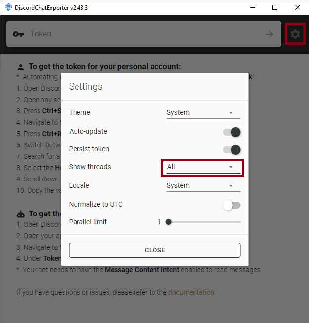

# DiscordChatExporter-frontend (DCEF / DCE-Frontend)

View and search your [DiscordChatExporter](https://github.com/Tyrrrz/DiscordChatExporter) exports in a Discord like user interface. [Try a demo in your browser :)](https://dcef.slada.sk/)


## Features

- Familiar Discord-like interface
- Search with autocomplete
- Optimized to handle really large exports well
- You own the data - use locally or self-host on a server
- Runs on Linux or Windows 

> Want to chat? Join [Tyrrrz's discord server](https://discord.gg/2SUWKFnHSm). I usually hang out in `#dce-frontend` channel.

NOTE: The exporter [DiscordChatExporter](https://github.com/Tyrrrz/DiscordChatExporter) is maintained by different maintainer than this viewer.


## How to use

### 1. Check prerequisites

Windows:
- Windows 10 or newer
- x64 architecture
- CPU with AVX support
- Available (and not excluded) ports `21011`, `27017` and `58000`

Linux:
- x64 or arm64 architecture
- Docker or Podman installed
- CPU with AVX support

Mac:
- Not supported (yet)


### 2. Export your data from Discord

JSON exports are downloaded using [DiscordChatExporter](https://github.com/Tyrrrz/DiscordChatExporter).

<details><summary><b>I am using GUI version of DiscordChatExporter</b></summary>

1. Download the latest GUI version of [DiscordChatExporter](https://github.com/Tyrrrz/DiscordChatExporter/releases) - most commonly used is `DiscordChatExporter.win-x64.zip` for 64-bit Windows

2. If you want to export threads and forum posts, set `Show threads` option to `All` in the general settings of DiscordChatExporter



3. Obtain a Discord token by following [this guide](https://github.com/Tyrrrz/DiscordChatExporter/blob/master/.docs/Token-and-IDs.md)

4. Enter your Discord token to DiscordChatExporter and press Enter

5. If you have enabled `Show threads` option, load times are longer than expected, it will eventually load :)

6. Select the channels you want to export (or press CTRL+A to select all channels)

7. **Make sure that export format is set to `JSON` and `Format markdown` is disabled. Enable `Download assets`+`Reuse assets` option to download images, videos and other types of assets.**


</details>

<details><summary><b>I am using CLI version of DiscordChatExporter</b></summary>

1. Download the latest CLI version of [DiscordChatExporter](https://github.com/Tyrrrz/DiscordChatExporter/releases) - most commonly used is `DiscordChatExporter.Cli.win-x64.zip` for 64-bit Windows
2. Extract it.
3. Open a terminal in the extracted folder by pressing ALT+D to highlight the path in the file explorer, then type type `cmd` and press Enter to open a terminal in that folder
3. Verify that DiscordChatExporter is working by running `DiscordChatExporter.Cli.exe --help`


Export all accessible channels, threads and forum posts in a server:

```bash
DiscordChatExporter.Cli.exe exportguild --token DISCORD_TOKEN -g SERVER_ID --media --reuse-media --markdown false --format Json --include-threads All --output OUTPUT_FOLDER_PATH
```


Export private messages:

```bash
DiscordChatExporter.Cli.exe exportdm --token DISCORD_TOKEN --media --reuse-media --markdown false --format Json --output OUTPUT_FOLDER_PATH
```

> TL;DR - always use `--media --reuse-media --markdown false --format Json` command line options for your exports to work with DCEF.


TIP: if you use Linux and want to automatically export your servers or DMs incrementally, you can try my [slatinsky/DiscordChatExporter-incrementalBackup](https://github.com/slatinsky/DiscordChatExporter-incrementalBackup) wrapper. You declare what you want to export in a config file and the wrapper will automatically export new messages from servers and DMs.

</details>


### 3. Install DCEF


<details><summary><b>I am using Windows</b></summary>

Only x64 architecture is supported. Won't work on Windows 7. Tested on Windows 10.

1. Download the latest release from [releases page](https://github.com/slatinsky/DiscordChatExporter-frontend/releases).
3. Extract the archive
4. Move your exports downloaded in the first chapter to `exports/` folder.
5. Apply a registry tweak located in `registry_tweaks/change_260_character_path_limit_to_32767.reg` and restart your computer. This tweak will increase the path limit to 32767 characters.

BUG: images and other assets won't load if the path to the assets [exceeds 260 characters](https://trac.nginx.org/nginx/ticket/1598) even with the registry tweak applied. FIX - Place your DCEF folder to a shorter path.

BETA BUILDS: Want to try new features? [Beta builds](https://github.com/slatinsky/DiscordChatExporter-frontend/actions/workflows/windows-build.yml). Beta builds are automatically built from the latest commit on `main` branch. (github account is needed to download them)

</details>


<details><summary><b>I am using Linux</b></summary>

Both `amd64` and `arm64` architectures are supported. Also your CPU is required to support AVX instructions (some VPS providers don't support it). Works for Raspberry Pi 5, but not on Raspberry Pi 4b (does not support AVX).

If you use `podman` instead of `docker`, replace `docker` with `podman` in the commands.

1. Pull the image from [docker hub](https://hub.docker.com/r/slada/dcef)

```bash
docker pull slada/dcef:main
```

2. Navigate to a folder with your exports downloaded in the first chapter

```bash
cd /path/to/your/exports
```

3. Run the container. This command will mount your current working directory to exports folder inside the container

```bash
docker run --restart=always --volume "$(pwd):/dcef/exports" --volume dcef_cache:/dcef/cache --name dcef -p 127.0.0.1:21011:21011 -it slada/dcef:main
```

The app will autostart with your computer if you are using `docker`. You need to create a systemd service to autostart the app if you use `podman`.

</details>


<details><summary><b>[for developers] I am to run the development version directly from the source code (Windows)</b></summary>

Install python3 and nodejs. Make sure that your `node --version` is at least `v18.17.1` and your `py --version` is at least `Python 3.11.0`. Make sure [Windows Terminal](https://github.com/microsoft/terminal) is installed (`wt --version`). Windows terminal is installed by default on Windows 11.
Install `nodemon` globally, which is used to automatically reload programs on change, by running `npm install -g nodemon`. Verify that it is installed correctly by running `nodemon --version`.

Then place your exports into `src/exports/` folder. Create that folder if it doesn't exist.

Then run in `cmd` the batch script `src/RUN_DEV.bat`:
```bash
cd src
RUN_DEV.bat
```

This script will install Python dependencies in virtual environment (stored in `src/_temp` folder) and will install frontend nodejs dependencies into `src/dcef/frontend/node_modules/`. Then it will open windows terminal with split panes with all the services needed to develop the app.

- frontend - automatically reloads on change. If you add a new dependency into `src/frontend/package.json`, close the watcher, run `npm install` and rerun `RUN_DEV.bat`
- fastapi - automatically reloads on change. Delete `src/_temp/fastapi/venv/` folder if you change a dependencies. Then rerun `RUN_DEV.bat`.
- nginx - needs to be restarted each time a config is updated - `taskkill /f /im dcefnginx.exe` and rerun `RUN_DEV.bat` again
- mongodb - if you need to clear the database, `taskkill /f /im dcefmongod.exe`, delete `src/_temp/mongodb/` folder and rerun `RUN_DEV.bat` again (preprocess will recreate the database from the scratch)
- preprocess - automatically reloads on change using nodemon. Delete `src/_temp/preprocess/venv/` folder if you change a dependencies. Then rerun `RUN_DEV.bat`.

</details>

<details><summary><b>[for developers] I want to compile my own Windows binaries from the source code</b></summary>

There are two ways to compile the Windows binaries:

1. Fork the project and run the github actions (located in `.github/workflows/windows-build.yml`) yourself. Then download the built binaries from the Github website.
2. Or follow the steps in previous chapter about setting up development environment. Then run `BUILD_RELEASE.bat` script located in `src/` directory. This script will compile the binaries and place them into `release/` folder. Test the binaries by running `release/dcef.exe`

Also you can download build for each commit into main branch from [my github actions](https://github.com/slatinsky/DiscordChatExporter-frontend/actions/workflows/windows-build.yml). You need to be logged-in to Github account to download them

</details>

<details><summary><b>[for developers] I want to build and run a docker image from the source code</b></summary>

Prerequisites: You need docker and git installed.

Clone the source code:

```bash
git clone https://github.com/slatinsky/DiscordChatExporter-frontend
cd DiscordChatExporter-frontend
```

Pull new changes from the git repository:

```bash
git pull
docker rm dcef --force
docker build -t dcef .
```


Run it:

```bash
cd release/exports/
docker run --restart=always --volume "$(pwd):/dcef/exports" --volume dcef_cache:/dcef/cache --name dcef -p 127.0.0.1:21011:21011 -d dcef
cd ../..
```


TIP: In case you encounter any problems with outdated exports, you can try to rebuild the database by deleting `dcef_cache` volume and then rerunning the container:

```bash
docker volume rm dcef_cache
```

</details>


### 4. Run DCEF

<details><summary><b>I am using Windows</b></summary>

1. Run `dcef.exe`
2. Wait for the program to process your exports. This will take several minutes
3. After preprocessing is finished, a window with graphical interface will appear. The same interface will also be available in your browser at [127.0.0.1:21011](http://127.0.0.1:21011/)

</details>


<details><summary><b>I am using Linux</b></summary>


Open [127.0.0.1:21011](http://127.0.0.1:21011/) in your browser to see graphical interface. It may take a while for all your exports to be visible. Check `docker logs dcef` to see the progress of the preprocessing.

TIP: change `-p 127.0.0.1:21011:21011` to `-p 21011:21011` in `docker run` command to make the viewer available from other devices in your network.

</details>


### 5. Secure DCEF

<details><summary><b>I am using Linux</b></summary>


The client-server architecture allows you to host the viewer on public servers. It is recommended to put the server behind another reverse proxy, such as nginx, that will handle SSL termination and authentication.

**Restrict open ports using firewall:**

Create firewall rules to open only TCP ports 22 (SSH) and 80 (HTTP) and enable firewall. If you want to use SSL, open port 443 (HTTPS) too.

```bash
ufw allow 22/tcp
ufw allow 80/tcp
ufw allow 443/tcp
ufw enable
```


**Check if DCEF port is bound only to loopback interface (localhost `127.0.0.1`):**

```bash
docker run ... -p 127.0.0.1:21011:21011 ...
```

**Secure the viewer with basic authentication:**

Create `.htpasswd` file:
```bash
sudo apt install apache2-utils
htpasswd -c /etc/nginx/.htpasswd <username>
<password>
```

**Change nginx site config to require authentication** (add lines `auth_basic` and `auth_basic_user_file`):

```conf
server {
        listen 80;

        location / {
            proxy_pass http://localhost:21011/;
            auth_basic           "Auth only";
            auth_basic_user_file /etc/nginx/.htpasswd;
        }
}
```

**Restart nginx:**

```bash
sudo systemctl restart nginx
```


NOTE: this is just a basic configuration and your password **is sent in plaintext**. If you own a domain, add SSL to encrypt the connection, use port 80 just to redirect to port 443. You can use free certificates from [Let's Encrypt](https://letsencrypt.org/) by configuring [Certbot](https://certbot.eff.org/) to automate the process. Find a more detailed guide on the internet.

</details>


## Upgrade DCEF to a new version

<details><summary><b>I am using Windows</b></summary>

1. Download the latest release zip from [releases page](https://github.com/slatinsky/DiscordChatExporter-frontend/releases) - name of the zip should be `DiscordChatExporter-frontend-vX.Y.Z-win.zip` where `X.Y.Z` is the version number.
2. Delete everything (except `exports/` folder) in your DiscordChatExporter-frontend folder.
3. Move everything (except `exports/` folder) from the new release zip to your DiscordChatExporter-frontend folder.

Tip: some upgrades don't require the database to be rebuilt. If you want to speed up the upgrade process, don't delete `_temp/mongodb/` folder. If the upgrade requires the database to be rebuilt, it will be handled automatically.

</details>

<details><summary><b>I am using Linux</b></summary>

Pull the new image from the [docker hub](https://hub.docker.com/r/slada/dcef) and restart the container.

```bash
cd path/to/your/exports/
docker rm dcef --force
docker image rm slada/dcef:main
docker pull slada/dcef:main
docker run --restart=always --volume "$(pwd):/dcef/exports" --volume dcef_cache:/dcef/cache --rm --name dcef -p 127.0.0.1:21011:21011 -it slada/dcef:main
```

</details>


## Downgrade DCEF to an older version

<details><summary><b>I am using Windows</b></summary>

1. Download older release zip from [releases page](https://github.com/slatinsky/DiscordChatExporter-frontend/releases) - name of the zip should be `DiscordChatExporter-frontend-vX.Y.Z-win.zip` where `X.Y.Z` is the version number.
2. Delete everything (except `exports/` folder) in your DiscordChatExporter-frontend folder.
3. **Delete `_temp/` folder**, which contains the database and other temporary files. This will force DCEF to rebuild the database from scratch and fill fix issues with the possibly incompatible database format.
4. Move everything (except `exports/` folder) from the release zip to your DiscordChatExporter-frontend folder.

</details>

<details><summary><b>I am using Linux</b></summary>

[Docker hub](https://hub.docker.com/r/slada/dcef) contains only the latest image built from the latest commit in main branch. if you want to use older version, you need to build the image from the source code.

Clone the git repository:

```bash
git clone https://github.com/slatinsky/DiscordChatExporter-frontend
cd DiscordChatExporter-frontend
```

Switch to the commit you want to build:

```bash
git checkout COMMIT_HASH
```

Remove the old image and the old database (`dcef_cache` volume):

```bash
docker rm dcef --force
docker volume rm dcef_cache
```

Build the image:

```bash
docker build -t dcef .
```

Run the image:

```bash
cd path/to/your/exports/
docker run --restart=always --volume "$(pwd):/dcef/exports" --volume dcef_cache:/dcef/cache --name dcef -p 127.0.0.1:21011:21011 -d dcef
```

</details>


## Uninstall DCEF

<details><summary><b>I am using Windows</b></summary>

This is a portable app. Just delete the folder with the app. But keep your exports from the `exports/` folder :).

Optionally also revert the registry tweak to decrease the path limit back to 260 characters. Run `registry_tweaks/restore_260_character_path_limit.reg` and restart your computer. But this is really not necessary.

</details>


<details><summary><b>I am using Linux</b></summary>

1. Kill and delete the container

```bash
docker rm dcef --force
```

2. Remove the volume

```bash
docker volume rm dcef_cache
```

3. Remove the image

```bash
docker image rm slada/dcef:main
```

</details>


## Troubleshooting

<details><summary><b>I am using Windows</b></summary>

Check the logs See logs `logs/dcef.log`.

Please check, if the top of the log contains line `windows-runner: OK: All required ports are available.`. DCEF needs ports `21011`, `27017`, `58000` to be available. If you have any of these ports occupied, DCEF won't start or won't work properly.

Check if one of those ports is not excluded by running `netsh int ipv4 show excludedportrange protocol=tcp`

Find line `found X json channel exports` - if this number is 0, you don't have any valid exports in `/exports/` folder. Did you export in `json` format instead of the default `html` format? Did you apply the registry tweak and restarted your computer?

Find if there is line `preprocess done` (at the end of lines `processing <PATH_TO_JSON_FILE>`) - if you see this line, preprocessing step finished successfully. If you don't see this line, please check if there is any stacktrace in the logs. Stacktrace looks like this:

```
Traceback (most recent call last):
  File "dcef/backend/preprocess/main_mongo.py", line 82, in <module>
    main(input_dir, output_dir)
  File "dcef/backend/preprocess/main_mongo.py", line 67, in main
    raise Exception("Example stack trace exception")
Exception: Example stack trace exception
```

Please [report this issue](https://github.com/slatinsky/DiscordChatExporter-frontend/issues/new) with the stacktrace attached.

The viewer is tested against standard install of Windows 10, so there may be issues if you have some non-standard Windows setup. [advanced users] If no other solution works for you, run Docker version of DCEF inside WSL2 and follow linux instructions.

</details>


<details><summary><b>I am using Linux</b></summary>

Check the logs

```bash
docker logs dcef
```


Find line `found X json channel exports` - if this number is 0, you don't have any valid exports in `/dcef/exports/` folder (inside the container). Did you mount the folder correctly? To debug this issue, get a shell inside the container and list the folder

```bash
docker exec -it dcef bash
cd /dcef/exports/
ls
```

Export should be visible in that `/dcef/exports/` folder

</details>


## FAQ

<details><summary><b>Some images and other assets won't display on Windows</b></summary>

ISSUE: Files in `/exports/` folder may exceed Windows path length limit of 260 characters. [An issue with nginx server](https://trac.nginx.org/nginx/ticket/1598) is preventing assets from being served correctly.

FIX: Move DCEF to a folder with shorter path, e.g. `C:\Users\User\Downloads\DiscordChatExporter-frontend-vX.Y.Z-win\` -> `C:\DCEF\`

</details>

<details><summary><b>Messages are out of sync with the exports folder</b></summary>

After you put your export to `exports/` folder, don't remove and don't move them. DCEF keeps track of files and other assets in this folder and if you remove or move them, they won't show up correctly in DCEF, because the old paths would become invalid.

**TL;DR - only adding new files to `exports/` folder is supported. If you want to remove or move files, you need to clear the database afterwards.**

Clearing database on Windows:
- close DCEF
- delete `_temp/mongodb/` folder
- start DCEF again

Clearing database on Linux:
- kill DCEF container
- remove `dcef_cache` volume (`docker volume rm dcef_cache`)
- start DCEF container again

</details>


<details><summary><b>Long preprocessing time</b></summary>

DCEF is not just an simple viewer. It needs to preprocess the data into a database, so you can search through the messages. This process can take a long time for large exports. The next time you run DCEF, the startup will be fast (it will only process new exports).

Impatient? Navigate to `http://127.0.0.1:21011/` in your browser to see already processed exports :)

</details>


<details><summary><b>DCEF won't run on Arm mac</b></summary>

Mac is not supported, but [this pull request](https://github.com/slatinsky/DiscordChatExporter-frontend/pull/30) may help you

</details>

<details><summary><b>DCEF is detected as a malware</b></summary>

DCEF is not a malware. It's a false positive. The project is open source, you can check the source code yourself.

The windows release is exactly the same as the ones built on Github's servers by [github actions](https://github.com/slatinsky/DiscordChatExporter-frontend/blob/main/.github/workflows/windows-build.yml). Executables (`nginx.exe`, `mongod.exe`) are sourced from their official websites. I upload releases manually, but the zip is exactly the same as the last successful build on github actions.

Docker image is built on Github's servers github actions [github actions](https://github.com/slatinsky/DiscordChatExporter-frontend/blob/main/.github/workflows/docker-image.yml) too. This action directly uploads the image to docker hub.

Tinfoil hat on? Replace `nginx.exe`, `mongod.exe`, `msvcp140.dll` and `vcruntime140_1.dll` with your own trusted copy. Then compile your own version from source code.

[Related discussion #13](https://github.com/slatinsky/DiscordChatExporter-frontend/discussions/13)

</details>


## Thanks

- [Tyrrrz/DiscordChatExporter](https://github.com/Tyrrrz/DiscordChatExporter) - for a great export tool

And for other great technologies used in this project - SvelteKit, Node.js, PyInstaller, nginx, MongoDB, Docker


## Related projects

- [Tyrrrz/DiscordChatExporter](https://github.com/Tyrrrz/DiscordChatExporter) - exporter for your Discord chats
- [Roachbones/discordless](https://github.com/Roachbones/discordless) - real time man-in-the-middle exporter
- [mlomb/chat-analytics](https://github.com/mlomb/chat-analytics) - analytics for your Discord chats
- [slatinsky/DiscordChatExporter-incrementalBackup](https://github.com/slatinsky/DiscordChatExporter-incrementalBackup) - incrementally export your Discord chats for DiscordChatExporter-frontend


## License

GNU GENERAL PUBLIC LICENSE. See [LICENSE](LICENSE) for more details.

This product contains software provided by NGINX and its contributors.

DiscordChatExporter-frontend is not affiliated with Discord. Discord is a registered trademark of Discord Inc.


## Contributing

Feel free to open issues and pull requests.

<details><summary><b>Short guide, how to contribute</b></summary>

- Fork the repository
- Create a new branch
- Implement your changes
- Commit and push your changes
- Create a pull request

</details>


If you find this project useful, give it a star ⭐. Thank you!
